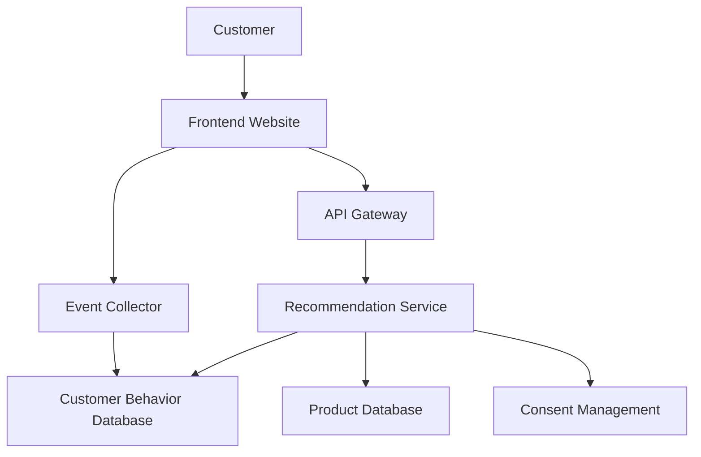

# Architecture Blueprint

## Project

E-commerce Recommendation System

## Business Goal

Increase online sales through personalized product recommendations

---

## Selected Architecture Pattern

**Event-Driven Microservices Architecture**

**Reason:** The system depends on customer behavior events such as clicks, purchases, and wishlists.

---

## Architecture Rationale

The selected architecture pattern fits the project because:

- The system depends on customer behavior events such as clicks, purchases, and wishlists.
- It supports the required business features.
- It matches the customer's scalability and compliance needs.

---

## Stakeholder View

Customer → Website → Recommendation System → Personalized Product Suggestions → Increased Sales

---

## Technical View

---

## Technical Components

- Frontend
- API Gateway
- Recommendation Service
- Event Collector
- Customer Behavior Database
- Product Database
- Consent Management

---

## Feature-to-Component Traceability

| Feature ID | Feature | Supporting Component |
|---|---|---|
| FEAT-001 | Product Recommendation | Recommendation Service |
| FEAT-002 | Customer Behavior Tracking | Event Collector + Customer Behavior Database |
| FEAT-003 | Website Recommendation Display | Frontend + API Gateway |
