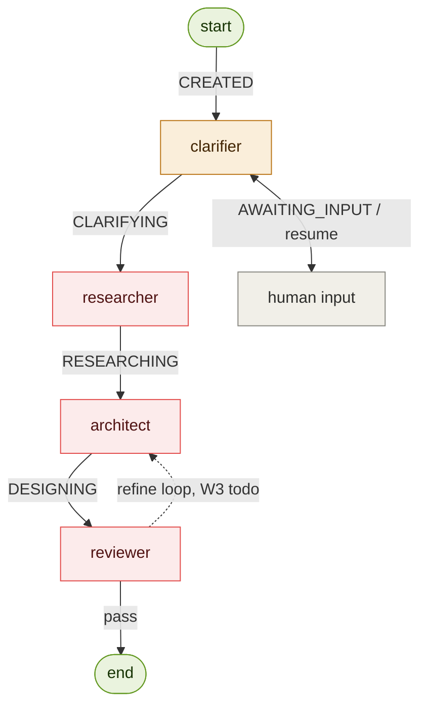

# Determinism map

Purpose: a complete inventory of every operation in the pipeline, each classified
by *how* it produces its output — deterministic **code**, stochastic **LLM**, a
**hybrid** of the two, or an external **human** step. For every non-deterministic
step it also records the guardrail that constrains it and the way it can fail.

This is the concrete evidence for the project's "determinism by default" principle:
it shows the LLM is used *only* where genuine reasoning is required, and never
touches control flow. The single source of truth for routing is the
`STAGE_TO_NODE` table in `orchestrator.py` — the arrow labels below are its keys.

## Flowchart

The boxes are where reasoning happens; the **arrows and start/end are code** —
that is the whole claim of the map. Colour encodes determinism class.

Legend: **code** (green) — routing, control flow, state; deterministic and
reproducible. **hybrid** (amber) — LLM judgment wrapped in a code + human gate.
**llm** (red) — generative reasoning; stochastic. **human** (gray) — external
input, not automated.

## Table

| # | Step | Type | What produces the output | Guardrail (what tames it) | Failure mode |
|---|------|------|--------------------------|---------------------------|--------------|
| 1 | `run.py` entry / `new_run` | CODE | Wraps the raw prompt into an `ArchitectState` | Pydantic v2 validation | none (pure) |
| 2 | Orchestrator `_route` / `_entry_route` / `STAGE_TO_NODE` | CODE | Picks the next node from `state.stage` | Static table; unknown stage → END; `recursion_limit` cap | mis-wired route → fails loudly, never hangs |
| 3 | `llm.py` `llm_call` | HYBRID | The wrapper is code; the model response is stochastic | Model registry, per-call system prompt, token accounting | API/network error, token overrun |
| 4 | Clarifier `_act` | HYBRID | LLM judges assume-vs-ask; the human answers | Deterministic gate + HITL `interrupt`; writes only `ContextRecord` | hallucinated assumption, poor question |
| 5 | Human input | HUMAN | User supplies answers on resume | — (external) | missing / ambiguous answer |
| 6 | Researcher `_act` | LLM | Reasons over RAG-retrieved KB chunks | RAG grounding (retrieval is code), citations | retrieval miss, ungrounded claim |
| 7 | Architect `_act` | LLM | Generates the blueprint / ADRs / component descriptions | Output-schema validation, retry cap | schema-invalid output, drift |
| 8 | Reviewer PASS/FAIL judgment | LLM | Scores the artifact against the eval rubric | Eval rubric | wrong verdict |
| 9 | Reviewer → REFINING routing | CODE | Sets `stage`; `_route` reads it (W3) | Same static table + retry cap | — |
| 10 | `persistence.checkpoint` (state on disk) | CODE | Serialises each emitted state to `.cache/runs/<run_id>/<NNN>_<stage>.json` | Atomic write (temp file + `os.replace`); `checkpoint` swallows every error | lost checkpoint (run continues), corrupt file (skipped by `list_runs`, raises in `load_state`) |

Rows 8 and 9 are split on purpose: the reviewer's *judgment* (is this good?) is
stochastic LLM, but the *action* taken on that judgment (loop back vs. finish) is
pure code in the router. That separation is exactly what proves the LLM never
decides control flow.

Row 10 is code for the same reason: persisting a state is plumbing, not a
judgment. It is hooked on a single line in `run_pipeline_streaming`, so it
observes transitions without participating in routing.

## Known deferrals

* **Inconsistent failure semantics in `run_pipeline` (mutation).** Every normal
  path returns a freshly validated state and leaves the caller's object
  untouched. The `GraphRecursionError` (step-cap) path is the one exception: it
  mutates the caller's `state` in place — appending to `errors` and calling
  `log_step` — and then returns that same object. So "run_pipeline does not
  mutate its input" holds everywhere except a step-cap blowout. Left as-is
  deliberately when state-on-disk landed: it predates that work, and `run.py` /
  `ui.py` currently observe a cap failure through the object they passed in.
  Fixing it is a contract change and wants its own commit. Consequence for
  persistence: the checkpoint written on that path (from the `finally` block in
  `run_pipeline_streaming`) is the caller's mutated object, not a stream
  emission — the only checkpoint in the system with that provenance.