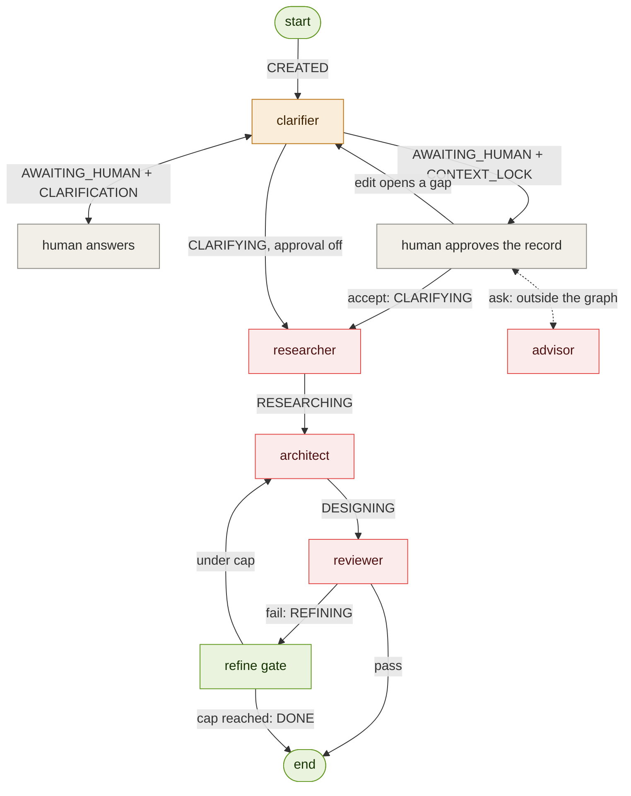

# Determinism map

Purpose: a complete inventory of every operation in the pipeline, each classified
by *how* it produces its output — deterministic **code**, stochastic **LLM**, a
**hybrid** of the two, or an external **human** step. For every non-deterministic
step it also records the guardrail that constrains it and the way it can fail.

This is the concrete evidence for the project's "determinism by default" principle:
it shows the LLM is used *only* where genuine reasoning is required, and never
touches control flow. The single source of truth for routing is the
`STAGE_TO_NODE` table in `orchestrator.py` — the arrow labels below are its keys.

## Flowchart

The boxes are where reasoning happens; the **arrows and start/end are code** —
that is the whole claim of the map. Colour encodes determinism class.

The dotted `advisor` edge is dotted because it is the one arrow that is NOT a
route: the advisory turn is a direct call from the caller, with no graph entry,
no routing decision and no stage change. It is in the picture because it spends
tokens, and anything that spends tokens has to be somewhere a reader can find
it.

Legend: **code** (green) — routing, control flow, state; deterministic and
reproducible. **hybrid** (amber) — LLM judgment wrapped in a code + human gate.
**llm** (red) — generative reasoning; stochastic. **human** (gray) — external
input, not automated.

## Table

| # | Step | Type | What produces the output | Guardrail (what tames it) | Failure mode |
|---|------|------|--------------------------|---------------------------|--------------|
| 1 | `run.py` entry / `new_run` | CODE | Wraps the raw prompt into an `ArchitectState` | Pydantic v2 validation | none (pure) |
| 2 | Orchestrator `_route` / `_entry_route` / `STAGE_TO_NODE` | CODE | Picks the next node from `state.stage` | Static table; unknown stage → END; `recursion_limit` cap (now `refine_gate.derive_max_steps()`, not a hard-coded 20); `_entry_route` refuses entry while `CONTEXT_LOCK` is pending | mis-wired route → fails loudly, never hangs |
| 3 | `llm.py` `llm_call` | HYBRID | The wrapper is code; the model response is stochastic | Model registry, per-call system prompt; usage **returned** per call as `LLMUsage`, summed by the `input_tokens`/`output_tokens` reducers, then enforced by `refine_gate.MAX_TOTAL_TOKENS` | API/network error; token overrun now stops the refine loop (but the cap itself is still untuned — see below) |
| 4 | Clarifier `clarifier_node` | HYBRID | LLM judges assume-vs-ask; code decides pause-vs-lock | Deterministic gate; `_can_ask` (code) revokes the power to ask after the first lock; sole writer of `ContextRecord` | hallucinated assumption, poor question |
| 4a | Context lock (`require_context_approval`) | CODE | Sets `stage=AWAITING_HUMAN`, `pending_decision=CONTEXT_LOCK` | Off by default so headless callers never hang; resolved by the caller before re-entry | a human who approves without reading |
| 4b | `clarifier.apply_user_edits` | CODE | Applies the human's veto pass to the record | Pure function; validates field name and shape, raises rather than dropping an edit | — (pure) |
| 4c | `clarifier.emptied_critical_fields` | CODE | Decides whether the edit needs re-judging | Compares before/after against `CRITICAL_RECORD_FIELDS`; an edit that fills a value provably makes no LLM call | a critical field missing from the list would skip a needed re-judge |
| 4d | `clarifier.ask_advisor` | LLM | Answers a read-only question about the paused record | Never enters the graph; writes no artifact, stage or `pending_decision`; append-only on `history` so its tokens stay reconcilable | ungrounded answer |
| 5 | Human input | HUMAN | Answers on resume, or approves / edits / questions the locked record | — (external); `MAX_USER_ROUNDS` caps total re-entries | missing / ambiguous answer; an unread approval |
| 6 | Researcher `_act` | LLM | Reasons over RAG-retrieved KB chunks | RAG grounding (retrieval is code), citations | retrieval miss, ungrounded claim |
| 7 | Architect `architect_node` | LLM | Generates the blueprint / ADRs / component descriptions | Output-schema validation, retry cap; on a REFINE pass phase 1 is skipped in code so feature IDs cannot drift between iterations (see below) | schema-invalid output; ADR/component IDs still drift across refine passes |
| 8 | Reviewer PASS/FAIL judgment | LLM | Scores the artifact against the eval rubric | Eval rubric | wrong verdict |
| 9 | Reviewer → REFINING routing | CODE | Sets `stage`; `_route` reads it (W3) | Same static table + retry cap | — |
| 9a | `refine_gate.score_round` / best-so-far selection | CODE | Ranks each reviewed design and hands back the best one when a cap trips | Pure total order over `ReviewResult`; strict `>` so ties keep the earlier round; the selected round and the discarded ones are named in the `StepLog` | a wrong ranking ships a worse design — the ordering is a stated judgment, not a measurement |
| 10 | `persistence.checkpoint` (state on disk) | CODE | Serialises each emitted state to `.cache/runs/<run_id>/<NNN>_<stage>.json` | Atomic write (temp file + `os.replace`); `checkpoint` swallows every error | lost checkpoint (run continues), corrupt file (skipped by `list_runs`, raises in `load_state`) |

Rows 4a-4d are the context lock, and they are split from row 4 for the same
reason rows 8 and 9 are split from each other. The Clarifier's *judgment* of
what is missing is stochastic; every decision taken on that judgment is code —
whether to pause, whether the human's edit needs re-judging, whether the model
is even allowed to ask this time. Row 4d is the one genuinely stochastic
addition, and it is deliberately outside the graph: it answers the human's
question and touches nothing else.

Rows 8 and 9 are split on purpose: the reviewer's *judgment* (is this good?) is
stochastic LLM, but the *action* taken on that judgment (loop back vs. finish) is
pure code in the router. That separation is exactly what proves the LLM never
decides control flow.

### Correction: row 3's token guardrail was dead until now

This row previously claimed "token accounting" as a working guardrail. It was
not one. `llm_call` recorded usage by mutating `state.input_tokens` /
`state.output_tokens` in place, and no node ever RETURNED those fields — and
LangGraph persists only what a node returns. Every count was therefore
discarded: an 11-call run finished reporting `input_tokens=0, output_tokens=0`,
so `refine_gate.evaluate_caps` compared 0 against its budget on every visit and
the run-cost cap could never trip. Only the iteration cap was doing any work.

Fixed by making `llm_call` pure with respect to state and returning
`(reply, LLMUsage)`; each node sums its own calls and returns the totals, which
the `operator.add` reducers accumulate. `test_token_accounting.py` pins this at
the full-graph level, which is where the bug lived — `llm_call` and the nodes
were each individually fine and only the wiring between them was broken.

Two honest caveats for the report:

* `MAX_TOTAL_TOKENS = 500_000` was chosen while counting was broken. It has now
  been measured against a real run — a complete greenfield run spending both
  refine iterations came to **24,719 tokens (~$0.016)** — which puts the ceiling
  at roughly 20x a full run. `MAX_REFINE_ITERATIONS` therefore always trips
  first and this cap never fires in normal operation. Describe it as a backstop,
  not as the budget the system runs to. It is left unchanged pending a decision;
  `refine_gate.py` records what to weigh before retuning it.
* Costs are computed from Google's published USD list prices, but this project
  runs on free-tier keys. Every dollar figure is a **list-price equivalent** —
  what the run would have cost on the paid tier — never money actually spent.

### `max_steps` was a hard-coded 20, silently coupled to the caps

`recursion_limit` has one real job: catch a mis-wired route before it loops
forever. It was also, accidentally, a second budget cap — 20 was chosen by hand
and sat just above the step count of a full-budget run, so raising
`MAX_REFINE_ITERATIONS` by two would have blown through it and surfaced as
`GraphRecursionError` → `FAILED`. A budget change would have arrived looking
like a crash, in a run that was behaving exactly as configured.

`refine_gate.derive_max_steps()` now computes it from the caps that determine
it, and `orchestrator.MAX_STEPS` is what every caller defaults to. The limit is
not weakened: a self-looping edge exhausts 32 steps as immediately as it
exhausted 20. Honest caveat about the formula — the `MAX_USER_ROUNDS` term is
headroom, not a tight bound, because `recursion_limit` is per invocation and
every user round starts a fresh one. It is in the formula so that raising ANY
cap is guaranteed never to present itself as a crash, which is worth more than
a tight bound on a limit whose purpose is catching wiring bugs.

Row 10 is code for the same reason: persisting a state is plumbing, not a
judgment. It is hooked on a single line in `run_pipeline_streaming`, so it
observes transitions without participating in routing.

## Failure semantics

`run_pipeline` never mutates its input, on **any** path. Normal transitions come
back as freshly validated states from the graph; the `GraphRecursionError`
(step-cap) path marks a deep copy FAILED rather than writing into the caller's
object. So a caller may always keep the state it passed in — to retry from, or
to compare against — and trust that it is unchanged.

One consequence for persistence: the checkpoint written on the step-cap path
comes from the `finally` block in `run_pipeline_streaming`, not from a stream
emission, because that FAILED state is born from an exception and never reaches
the graph. It is the only checkpoint in the system with that provenance, and
`test_persistence.test_step_cap_failure_is_checkpointed` pins it.

## The context lock (added with the human gate)

`CLARIFIER_SYSTEM` always said low-stakes gaps are recorded as labelled
assumptions "so a human can later veto them". Nothing offered that veto: the
record froze and the run spent research, design and review on ground truth the
human had never seen. The lock is that veto, and it is placed at the only point
where a correction is still free.

Four properties make it a determinism claim rather than a feature:

* **One pause stage, one discriminator.** `AWAITING_HUMAN` + `pending_decision`,
  not an `AWAITING_*` stage per interaction. The router keeps reading exactly
  one field, and every future touchpoint (feature A's feedback at DONE) adds a
  `PendingDecision` member rather than a routing rule.
* **Code decides when the model runs.** An edit that fills or replaces a value
  cannot open a gap, so it re-freezes the record with no model call at all. Only
  emptying an architecture-critical field — or asking for a recommendation —
  costs a call. `emptied_critical_fields` is a pure diff; the model judges only
  when there is something left to judge.
* **Ask once, then assume.** After the first lock the clarifier loses the power
  to pause with questions (`_can_ask`, code). A critical gap becomes a labelled
  assumption plus an open question on the record the human is already reading.
  The invariant was never "always ask" — it is "never assume SILENTLY", and this
  satisfies it while removing the only unbounded loop in the design. It also
  contains the `missing_critical`-without-`questions` bug in row 4, which used
  to park a run at a pause with nothing to answer.
* **The advisory turn is not a route.** It runs outside the graph entirely, so
  understanding the record costs one call rather than a full re-clarification.
  Read-only on artifacts, append-only on `history` — because a call that spends
  tokens without appearing in the per-agent ledger makes the whole ledger
  untrustworthy, which is a worse outcome than the call itself being expensive.

Default-off is part of the claim too. `pipeline/run.py`, the eval harness and
the test suite all drive the pipeline with no human attached; a mandatory pause
would have converted every one of them into a hang. The UI sets it, the CLI
exposes it as `--approve-context`, and everything else behaves exactly as it did
before the gate existed.

## Why the refine loop could not close its own findings

Measured on run `20260818T074835Z-1925fbd7` and reproduced under controlled
conditions in `20260818T083414Z-60d10c09`.

The architect ran BOTH phases on every pass: phase 1 re-derived the feature set
from the Context Record, phase 2 designed against it. Feature IDs are
positional, so a re-derivation that produced a different number of features
renumbered them. Across three passes of one run the counts were 5, 4, 5; in the
controlled reproduction, 4, 4, 3.

The reviewer's `traceability` check keys on feature IDs, and its instruction
therefore named one — *"Assign FEAT-005 to a component"*. By the time the
architect acted on that instruction, `FEAT-005` was a different feature, or did
not exist. The loop was being asked to fix a reference to a moving target, and
both refine iterations went into it.

The fix is one predicate in `agents/architect.py`: on a refine pass, reuse
`state.features` and run phase 2 only. This is a CODE decision about when the
model is allowed to invent — the same shape as the clarifier's `_can_ask` and
the context gate's `emptied_critical_fields`. Nothing in the reviewer changed,
and nothing repairs `related_feature_ids` by construction: auto-repairing a
scored rubric item would make it score 2 forever and stop measuring anything.

Measured result: feature IDs identical across all three rounds, and
`traceability` reached 2 by round 3 with the full feature set intact. Without
the fix, the same scenario also reached traceability 2 — by DROPPING the
unimplemented feature, which is the check passing because the evidence
disappeared rather than because the design improved.

The run still ends `stopped_on_cap`. What blocks it now is two LLM judgments,
`flaw_detection` and `refinement_readiness` — not the deterministic checks. See
the note in `agents/reviewer.py` for the agreed handling of the second one.

## Best-so-far selection at the refine gate

`refine_gate.py` promised for a long time that a capped run "finishes gracefully
as DONE, keeping the best-so-far artifacts". It did not. It halted, and whatever
the last architect pass produced was what shipped — "best-so-far" meaning "most
recent", which is not what the words mean.

Run `20260818T083516Z-e92aa7cf` made that measurable: `flaw_detection` passed in
round 2 and failed again in round 3, so the run shipped a round-3 design over a
round-2 design that had scored strictly better. Nothing was wrong with the loop.
The gate simply was not choosing.

Choosing is CODE, which is why it belongs in this map and in that node:

* `score_round(review) -> tuple` is a pure total order over a `ReviewResult` —
  pass beats fail, then fewer high-severity issues, then a higher code-check
  sum, then more passing LLM judgments, then fewer issues. No LLM, no state, no
  routing.
* The gate keeps ONE incumbent and replaces it only on a strict improvement, so
  ties resolve to the earlier round and selection is stable.
* On the stop branch it restores the incumbent's artifacts **and its review**
  together. Restoring one without the other would produce a report that
  confidently describes a design the run does not contain.
* The `StepLog` names the selected round and the discarded ones. An artifact
  swap that leaves no trace is an audit-trail defect.

It does NOT change the verdict. `overall_status`, `stopped_on_cap` and
`refine_iterations` come out exactly as before; only WHICH already-paid-for
design is returned changes.

One honest caveat about the ordering. Ranking high-severity issues ABOVE the
code-check sum is a judgment, not a measurement: a design that structurally
addresses the flaw but has a traceability gap is held to be better than one that
is tidy and misses the flaw. That line is load-bearing rather than decorative —
on `20260818T083516Z-e92aa7cf` it is exactly what decides the case, since round
2 has zero high-severity issues with a code sum of 7 while round 3 has one
high-severity issue with a code sum of 8. If the judgment is wrong, it is wrong
in five lines of `score_round` and can be argued with there.
