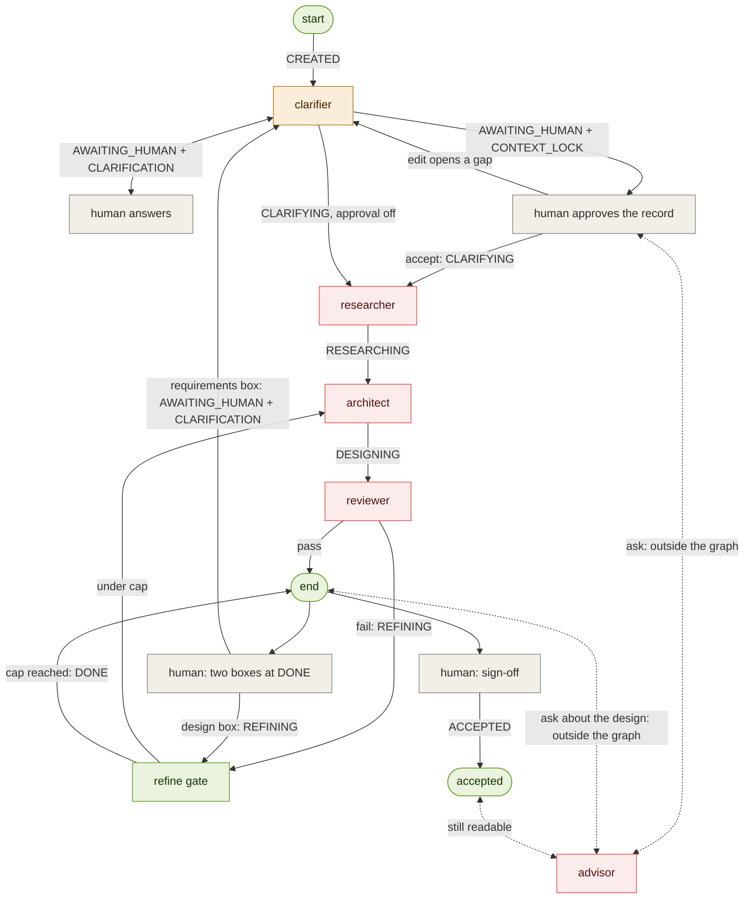

# Determinism map

Purpose: a complete inventory of every operation in the pipeline, each classified
by *how* it produces its output — deterministic **code**, stochastic **LLM**, a
**hybrid** of the two, or an external **human** step. For every non-deterministic
step it also records the guardrail that constrains it and the way it can fail.

This is the concrete evidence for the project's "determinism by default" principle:
it shows the LLM is used *only* where genuine reasoning is required, and never
touches control flow. The single source of truth for routing is the
`STAGE_TO_NODE` table in `orchestrator.py` — the arrow labels below are its keys.

## Flowchart

The boxes are where reasoning happens; the **arrows and start/end are code** —
that is the whole claim of the map. Colour encodes determinism class.

The dotted `advisor` edge is dotted because it is the one arrow that is NOT a
route: the advisory turn is a direct call from the caller, with no graph entry,
no routing decision and no stage change. It is in the picture because it spends
tokens, and anything that spends tokens has to be somewhere a reader can find
it.

Legend: **code** (green) — routing, control flow, state; deterministic and
reproducible. **hybrid** (amber) — LLM judgment wrapped in a code + human gate.
**llm** (red) — generative reasoning; stochastic. **human** (gray) — external
input, not automated.

## Table

| # | Step | Type | What produces the output | Guardrail (what tames it) | Failure mode |
|---|------|------|--------------------------|---------------------------|--------------|
| 1 | `run.py` entry / `new_run` | CODE | Wraps the raw prompt into an `ArchitectState` | Pydantic v2 validation | none (pure) |
| 2 | Orchestrator `_route` / `_entry_route` / `STAGE_TO_NODE` | CODE | Picks the next node from `state.stage` | Static table; unknown stage → END; `recursion_limit` cap (now `refine_gate.derive_max_steps()`, not a hard-coded 20); `_entry_route` refuses entry while `CONTEXT_LOCK` is pending | mis-wired route → fails loudly, never hangs |
| 3 | `llm.py` `llm_call` | HYBRID | The wrapper is code; the model response is stochastic | Model registry, per-call system prompt; usage **returned** per call as `LLMUsage`, summed by the `input_tokens`/`output_tokens` reducers, then enforced by `refine_gate.MAX_TOTAL_TOKENS` | API/network error; token overrun now stops the refine loop (but the cap itself is still untuned — see below) |
| 4 | Clarifier `clarifier_node` | HYBRID | LLM judges assume-vs-ask; code decides pause-vs-lock | Deterministic gate; `_can_ask` (code) revokes the power to ask after the first lock; sole writer of `ContextRecord` | hallucinated assumption, poor question |
| 4a | Context lock (`require_context_approval`) | CODE | Sets `stage=AWAITING_HUMAN`, `pending_decision=CONTEXT_LOCK` | Off by default so headless callers never hang; resolved by the caller before re-entry | a human who approves without reading |
| 4b | `clarifier.apply_user_edits` | CODE | Applies the human's veto pass to the record | Pure function; validates field name and shape, raises rather than dropping an edit | — (pure) |
| 4c | `clarifier.emptied_critical_fields` | CODE | Decides whether the edit needs re-judging | Compares before/after against `CRITICAL_RECORD_FIELDS`; an edit that fills a value provably makes no LLM call | a critical field missing from the list would skip a needed re-judge |
| 4d | `clarifier.ask_advisor` | LLM | Answers a read-only question about whichever `subject` was passed — the paused record, or the finished design at DONE/ACCEPTED | Never enters the graph; writes no artifact, stage or `pending_decision`; append-only on `history` so its tokens stay reconcilable | ungrounded answer |
| 5 | Human input | HUMAN | Answers on resume, approves / edits / questions the locked record, or sends feedback on the finished run | — (external); `MAX_USER_ROUNDS` caps the re-entries that ask for work to be REDONE (a gap-opening edit, and feedback at DONE) | missing / ambiguous answer; an unread approval |
| 6 | Researcher `_act` | LLM | Reasons over RAG-retrieved KB chunks | RAG grounding (retrieval is code), citations | retrieval miss, ungrounded claim |
| 7 | Architect `architect_node` | LLM | Generates the blueprint / ADRs / component descriptions | Output-schema validation, retry cap; on a REFINE pass phase 1 is skipped in code so feature IDs cannot drift between iterations (see below) | schema-invalid output; ADR/component IDs still drift across refine passes |
| 8 | Reviewer PASS/FAIL judgment | LLM | Scores the artifact against the eval rubric | Eval rubric | wrong verdict |
| 8a | Reviewer `review_checks._check_target_service_ownership` | CODE | Blocks a design whose Features, ADRs, Blueprint components/data flows, or Component dependencies reference a named target service ("<Name> Service", a list of such names, or a Blueprint component entry) with no matching Component Description and no explicit legacy/external/ownership disposition anywhere in the artifacts | Suffix-and-list regexes over the target-describing fields only (ADR alternatives and negative consequences are excluded); blocklist of non-name words; sentence-level allowance markers for legacy retention, external providers, and ownership by an existing component; emits one high-severity `traceability` issue per unowned service, so `derive_verdict` routes the run to REFINING | a genuine service named only by a bare noun ("Inventory" without the "Service" suffix) is not caught — deliberate, to avoid flagging generic nouns; a service that exists only as a managed-infrastructure name (e.g. "SQS") is only checked when the Blueprint lists it as a component |
| 9 | Reviewer → REFINING routing | CODE | Sets `stage`; `_route` reads it (W3) | Same static table + retry cap | — |
| 9a | `refine_gate.score_round` / best-so-far selection | CODE | Ranks each reviewed design and hands back the best one when a cap trips | Pure total order over `ReviewResult`; strict `>` so ties keep the earlier round; the selected round and the discarded ones are named in the `StepLog` | a wrong ranking ships a worse design — the ordering is a stated judgment, not a measurement |
| 9b | `user_feedback.submit_feedback` (feedback at DONE) | CODE | Routes on WHICH box the text came from; appends the entry, files a requirements correction under a per-submission key | No classifier — the box is the route; `reopen_for_user_round` charges the round and resets the caps; refuses at DONE only, and records nothing on a refused round | a person typing a design change into the requirements box pays for a full re-run (mitigated by both boxes being visible, and by the warning on the requirements box) |
| 9c | Architect `<user_directive>` block | HYBRID | The human's words are injected verbatim; the model applies them | Own block, ranked above `<refinement_instruction>`; the preservation rule gains a third exit so a named component may be changed; marked `applied` only after the pass succeeds | the model ignores or over-applies the directive — visible in `revision_note` and in the artifacts |
| 9d | Architect `directive_objection` | HYBRID | The model reports a directive it could not build as stated; code files it on the matching `UserFeedback` entry | One objection per pass, then the run proceeds — a voice, not a veto; dropped entirely when no directive was in the prompt; NEVER read back into any prompt | the model objects to something it could in fact have built, or stays silent and substitutes something else anyway |
| 9e | `sign_off.accept_design` (the human takes the design) | CODE | Writes `ACCEPTED`, `accepted_at`, the `Waiver`, and abandons anything still `pending` | Pure policy in code: refuses anywhere but DONE and refuses a second time; never blocks on findings or on unapplied text; `requires_deliberate_confirmation` is the one severity rule, not a property of a widget | a human who signs off without reading the findings the panel put above the button |
| 10 | `persistence.checkpoint` (state on disk) | CODE | Serialises each emitted state to `.cache/runs/<run_id>/<NNN>_<stage>.json` | Atomic write (temp file + `os.replace`); `checkpoint` swallows every error | lost checkpoint (run continues), corrupt file (skipped by `list_runs`, raises in `load_state`) |

Rows 4a-4d are the context lock, and they are split from row 4 for the same
reason rows 8 and 9 are split from each other. The Clarifier's *judgment* of
what is missing is stochastic; every decision taken on that judgment is code —
whether to pause, whether the human's edit needs re-judging, whether the model
is even allowed to ask this time. Row 4d is the one genuinely stochastic
addition, and it is deliberately outside the graph: it answers the human's
question and touches nothing else.

Rows 8 and 9 are split on purpose: the reviewer's *judgment* (is this good?) is
stochastic LLM, but the *action* taken on that judgment (loop back vs. finish) is
pure code in the router. That separation is exactly what proves the LLM never
decides control flow.

### Correction: row 3's token guardrail was dead until now

This row previously claimed "token accounting" as a working guardrail. It was
not one. `llm_call` recorded usage by mutating `state.input_tokens` /
`state.output_tokens` in place, and no node ever RETURNED those fields — and
LangGraph persists only what a node returns. Every count was therefore
discarded: an 11-call run finished reporting `input_tokens=0, output_tokens=0`,
so `refine_gate.evaluate_caps` compared 0 against its budget on every visit and
the run-cost cap could never trip. Only the iteration cap was doing any work.

Fixed by making `llm_call` pure with respect to state and returning
`(reply, LLMUsage)`; each node sums its own calls and returns the totals, which
the `operator.add` reducers accumulate. `test_token_accounting.py` pins this at
the full-graph level, which is where the bug lived — `llm_call` and the nodes
were each individually fine and only the wiring between them was broken.

Two honest caveats for the report:

* `MAX_TOTAL_TOKENS = 500_000` was chosen while counting was broken. It has now
  been measured against a real run — a complete greenfield run spending both
  refine iterations came to **24,719 tokens (~$0.016)** — which puts the ceiling
  at roughly 20x a full run. `MAX_REFINE_ITERATIONS` therefore always trips
  first and this cap never fires in normal operation. Describe it as a backstop,
  not as the budget the system runs to. It is left unchanged pending a decision;
  `refine_gate.py` records what to weigh before retuning it.
* Costs are computed from Google's published USD list prices, but this project
  runs on free-tier keys. Every dollar figure is a **list-price equivalent** —
  what the run would have cost on the paid tier — never money actually spent.

### `max_steps` was a hard-coded 20, silently coupled to the caps

`recursion_limit` has one real job: catch a mis-wired route before it loops
forever. It was also, accidentally, a second budget cap — 20 was chosen by hand
and sat just above the step count of a full-budget run, so raising
`MAX_REFINE_ITERATIONS` by two would have blown through it and surfaced as
`GraphRecursionError` → `FAILED`. A budget change would have arrived looking
like a crash, in a run that was behaving exactly as configured.

`refine_gate.derive_max_steps()` now computes it from the caps that determine
it, and `orchestrator.MAX_STEPS` is what every caller defaults to. The limit is
not weakened: a self-looping edge exhausts 32 steps as immediately as it
exhausted 20. Honest caveat about the formula — the `MAX_USER_ROUNDS` term is
headroom, not a tight bound, because `recursion_limit` is per invocation and
every user round starts a fresh one. It is in the formula so that raising ANY
cap is guaranteed never to present itself as a crash, which is worth more than
a tight bound on a limit whose purpose is catching wiring bugs.

Row 10 is code for the same reason: persisting a state is plumbing, not a
judgment. It is hooked on a single line in `run_pipeline_streaming`, so it
observes transitions without participating in routing.

## Failure semantics

`run_pipeline` never mutates its input, on **any** path. Normal transitions come
back as freshly validated states from the graph; the `GraphRecursionError`
(step-cap) path marks a deep copy FAILED rather than writing into the caller's
object. So a caller may always keep the state it passed in — to retry from, or
to compare against — and trust that it is unchanged.

One consequence for persistence: the checkpoint written on the step-cap path
comes from the `finally` block in `run_pipeline_streaming`, not from a stream
emission, because that FAILED state is born from an exception and never reaches
the graph. It is the only checkpoint in the system with that provenance, and
`test_persistence.test_step_cap_failure_is_checkpointed` pins it.

## The context lock (added with the human gate)

`CLARIFIER_SYSTEM` always said low-stakes gaps are recorded as labelled
assumptions "so a human can later veto them". Nothing offered that veto: the
record froze and the run spent research, design and review on ground truth the
human had never seen. The lock is that veto, and it is placed at the only point
where a correction is still free.

Four properties make it a determinism claim rather than a feature:

* **One pause stage, one discriminator.** `AWAITING_HUMAN` + `pending_decision`,
  not an `AWAITING_*` stage per interaction. The router keeps reading exactly
  one field, and every future touchpoint (feature A's feedback at DONE) adds a
  `PendingDecision` member rather than a routing rule.
* **Code decides when the model runs.** An edit that fills or replaces a value
  cannot open a gap, so it re-freezes the record with no model call at all. Only
  emptying an architecture-critical field — or asking for a recommendation —
  costs a call. `emptied_critical_fields` is a pure diff; the model judges only
  when there is something left to judge.
* **Ask once, then assume.** After the first lock the clarifier loses the power
  to pause with questions (`_can_ask`, code). A critical gap becomes a labelled
  assumption plus an open question on the record the human is already reading.
  The invariant was never "always ask" — it is "never assume SILENTLY", and this
  satisfies it while removing the only unbounded loop in the design. It also
  contains the `missing_critical`-without-`questions` bug in row 4, which used
  to park a run at a pause with nothing to answer.
* **The advisory turn is not a route.** It runs outside the graph entirely, so
  understanding the record costs one call rather than a full re-clarification.
  Read-only on artifacts, append-only on `history` — because a call that spends
  tokens without appearing in the per-agent ledger makes the whole ledger
  untrustworthy, which is a worse outcome than the call itself being expensive.

Default-off is part of the claim too. `pipeline/run.py`, the eval harness and
the test suite all drive the pipeline with no human attached; a mandatory pause
would have converted every one of them into a hang. The UI sets it, the CLI
exposes it as `--approve-context`, and everything else behaves exactly as it did
before the gate existed.

## Why the refine loop could not close its own findings

Measured on run `20260818T074835Z-1925fbd7` and reproduced under controlled
conditions in `20260818T083414Z-60d10c09`.

The architect ran BOTH phases on every pass: phase 1 re-derived the feature set
from the Context Record, phase 2 designed against it. Feature IDs are
positional, so a re-derivation that produced a different number of features
renumbered them. Across three passes of one run the counts were 5, 4, 5; in the
controlled reproduction, 4, 4, 3.

The reviewer's `traceability` check keys on feature IDs, and its instruction
therefore named one — *"Assign FEAT-005 to a component"*. By the time the
architect acted on that instruction, `FEAT-005` was a different feature, or did
not exist. The loop was being asked to fix a reference to a moving target, and
both refine iterations went into it.

The fix is one predicate in `agents/architect.py`: on a refine pass, reuse
`state.features` and run phase 2 only. This is a CODE decision about when the
model is allowed to invent — the same shape as the clarifier's `_can_ask` and
the context gate's `emptied_critical_fields`. Nothing in the reviewer changed,
and nothing repairs `related_feature_ids` by construction: auto-repairing a
scored rubric item would make it score 2 forever and stop measuring anything.

Measured result: feature IDs identical across all three rounds, and
`traceability` reached 2 by round 3 with the full feature set intact. Without
the fix, the same scenario also reached traceability 2 — by DROPPING the
unimplemented feature, which is the check passing because the evidence
disappeared rather than because the design improved.

The run still ends `stopped_on_cap`. What blocks it now is two LLM judgments,
`flaw_detection` and `refinement_readiness` — not the deterministic checks. See
the note in `agents/reviewer.py` for the agreed handling of the second one.

## Best-so-far selection at the refine gate

`refine_gate.py` promised for a long time that a capped run "finishes gracefully
as DONE, keeping the best-so-far artifacts". It did not. It halted, and whatever
the last architect pass produced was what shipped — "best-so-far" meaning "most
recent", which is not what the words mean.

Run `20260818T083516Z-e92aa7cf` made that measurable: `flaw_detection` passed in
round 2 and failed again in round 3, so the run shipped a round-3 design over a
round-2 design that had scored strictly better. Nothing was wrong with the loop.
The gate simply was not choosing.

Choosing is CODE, which is why it belongs in this map and in that node:

* `score_round(review) -> tuple` is a pure total order over a `ReviewResult` —
  pass beats fail, then fewer high-severity issues, then a higher code-check
  sum, then more passing LLM judgments, then fewer issues. No LLM, no state, no
  routing.
* The gate keeps ONE incumbent and replaces it only on a strict improvement, so
  ties resolve to the earlier round and selection is stable.
* On the stop branch it restores the incumbent's artifacts **and its review**
  together. Restoring one without the other would produce a report that
  confidently describes a design the run does not contain.
* The `StepLog` names the selected round and the discarded ones. An artifact
  swap that leaves no trace is an audit-trail defect.

It does NOT change the verdict. `overall_status`, `stopped_on_cap` and
`refine_iterations` come out exactly as before; only WHICH already-paid-for
design is returned changes.

One honest caveat about the ordering. Ranking high-severity issues ABOVE the
code-check sum is a judgment, not a measurement: a design that structurally
addresses the flaw but has a traceability gap is held to be better than one that
is tidy and misses the flaw. That line is load-bearing rather than decorative —
on `20260818T083516Z-e92aa7cf` it is exactly what decides the case, since round
2 has zero high-severity issues with a code sum of 7 while round 3 has one
high-severity issue with a code sum of 8. If the judgment is wrong, it is wrong
in five lines of `score_round` and can be argued with there.

## User feedback at DONE — four ways it could have been a no-op

The functional requirement is "enable iterative refinement with user feedback".
The hard part is not collecting the text. It is that every plausible way to wire
this fails SILENTLY — the box accepts a paragraph, the run restarts, and nothing
the person asked for happens, with no error anywhere. Four of those were real,
and each is now a test in `test_user_feedback.py`.

**1. The stale cost caps.** The obvious implementation is "set
`stage = REFINING` and re-run". A run that ended on the cap re-enters at the
refine gate with `stopped_on_cap = True` and `refine_iterations` at the ceiling;
the gate re-trips the same cap on its first visit and routes straight back to
DONE. `refine_gate.reopen_for_user_round` is the fix — ONE function, both paths,
charging the round through `begin_user_round` (still the only writer of
`user_rounds`) and clearing the four fields that would otherwise eat it.

**2. The incumbent design.** Clearing `best_design` is necessary and not
sufficient. The first gate visit after design feedback does not follow a
reviewer verdict — the artifacts on the state are the ones the human objected to
— so the gate would immediately re-nominate that design as the incumbent and
could hand it back two rounds later, reverting the directive. The guard is
semantic rather than positional: while a design directive is `pending`, the
design on the state is one nobody has redirected yet, so it is not a candidate.

**3. The preservation rule.** The rule added for component reuse says to keep
component names, ADR IDs and every decision the findings do not mention exactly
as they are. A user directive is not a finding, so as written the architect
would have faithfully preserved the very thing the user asked to change. The
rule now has three exits — findings, structural necessity, and user direction —
and the third one says so explicitly: anything named in `<user_directive>` is a
licence to change.

**4. A fixed key for the correction.** A requirements correction is filed into
`clarification_answers`, which is a dict. Under a fixed key the second
correction overwrites the first: the clarifier re-judges against text the person
has moved on from, and what they just typed is gone. The key carries the round
number, and the round number is charged once per submission.

### What stayed out of the router

Nothing was added to `STAGE_TO_NODE`, no new `Stage`, and no new
`PendingDecision`. A requirements correction re-opens the run as an ordinary
CLARIFICATION and the clarifier re-judges exactly as it does after a gate edit;
a design directive is not a pause at all — `REFINING` re-enters the loop that
already exists. The route is decided by WHICH BOX the text was typed into, which
is known before any model runs, so a human-in-the-loop feature adds exactly zero
stochastic routing. That is also the argument for showing both boxes at once
rather than as tabs: hiding one is what makes people put everything in the
first, and a mis-filed correction is the one input this design cannot recover
from.

### The record is frozen per version, not edited

A correction does not rewrite the Context Record. The clarifier — still its only
writer — re-freezes it as `version + 1` with `revision_reason` set from the
human's own words, and the outgoing record is pushed onto `context_history`.
That is what lets the trail say "the v1 design was correct given what we knew at
v1" instead of quietly rewriting the ground truth so every past decision looks
wrong. `_may_ask` is already false once a record exists, so the re-judge cannot
open a fresh round of questions: any gap the correction opens becomes a labelled
assumption on a record the human is shown at the approval gate before the
expensive work runs.

The requirements path also drops `features` and `review`, and only that path
does. Both are derived from the record that was just superseded — the features
literally, the review as a verdict on a design built for it — so carrying them
forward would have the architect reuse a v1 feature set under a v1 reviewer
instruction naming v1 feature IDs while designing against a v2 record. A design
directive supersedes nothing, so there the findings still apply and travel into
the same prompt as the directive, ranked below it.

### Measured, on two live runs

Greenfield, same prompt both times.

| | to DONE | after feedback |
|---|---|---|
| **design directive** ("replace the broker with SQS+SNS, add ElastiCache") | `user_rounds` 0, `refine_iterations` 1, record v1, 21,608 tokens | `user_rounds` 1, `refine_iterations` 1, record v1, 32,094 tokens |
| **requirements correction** ("Azure not AWS; 500k peak, not 50k") | `user_rounds` 0, `refine_iterations` 0, record v1, 11,907 tokens | `user_rounds` 1, `refine_iterations` 1, **record v2**, 33,092 tokens |

The design directive cost ~10.5k tokens and produced two new components
(`CacheStore`, `NotificationTopic`) with `revision_note` reading "Replaced
self-managed message broker logic with AWS SQS/SNS and added Amazon ElastiCache
for product catalogue read performance, per user directive." The four existing
components and both ADR IDs came through unchanged — the preservation rule and
its new third exit doing exactly the two different jobs they are meant to.

The requirements correction cost ~21k tokens, which is the honest price of the
expensive path: the record re-froze as v2 (`cloud_provider` AWS → Microsoft
Azure, the scale NFR 50k → 500k), v1 went to `context_history`, the approval
gate re-appeared with no new questions and four labelled assumptions — one of
them explicitly attributing the change to the human — and after approval the
researcher ran a SECOND time against a query that had itself changed. The
architect then re-derived the feature set and the technical view mentions Azure
and no longer mentions AWS.

One honest observation from run A, unrelated to routing: the revision pass came
back with `technology_choices` empty on every component, where the first pass had
filled them. Nothing in the rubric scores that field, so the review still passed.
It is the ordinary failure mode of asking a model to rewrite a large structured
artifact, and it argues for a future deterministic check on fields that were
populated before a revision and empty after — not for a change to this feature.

## Sign-off, waivers and objections (governance at DONE)

### DONE is not ACCEPTED

`DONE` means the pipeline stopped. `ACCEPTED` means a person took the design.
Those are two different facts, and until A2 the trail recorded only the first —
so an unread run and a signed-off one were the same run on disk.

`ACCEPTED` is the second terminal stage. It is absent from `STAGE_TO_NODE` for
exactly the reason `DONE` is, so it routes to `END` with no new row and no new
branch, and it is **unreachable from inside the graph**: no node writes it. It
is written by one explicit human action, outside the graph, in
`pipeline/sign_off.py`. A1 added a human touchpoint and cost the router nothing;
A2 adds a terminal stage and costs it nothing either.

A design the reviewer did NOT pass may be accepted, and that is the normal case
rather than an escape hatch. Most runs end `stopped_on_cap` with open findings,
so a sign-off gated on a passing review would leave exactly the runs that need
closing out unable to be closed.

### The waiver is what makes a best-effort acceptance legible

Without it, an accepted best-effort design and an accepted clean one are
indistinguishable the moment the run is closed. So a sign-off against open
findings records a `Waiver` naming every one of them, their severities, the
review's verdict at the time, and an optional note. One waiver per sign-off, not
one per finding: a person signs off once, on the whole picture.

A clean sign-off records **no waiver at all**, and its absence is the
information. A waiver with an empty finding list would destroy that distinction
in exchange for schema tidiness.

The findings go above the button, highest severity first, so what is being
accepted is on screen before it is accepted. A HIGH-severity finding needs a
second, deliberate confirmation; a medium or low one does not — a confirmation
that everything triggers is a confirmation nobody reads.

### Unapplied feedback is surfaced, never blocking

A1 leaves a `UserFeedback` entry `pending` until its agent consumes it. Someone
who types a directive and then signs off without re-running leaves one behind,
and a `pending` entry on a closed run is indistinguishable from one that is
queued and about to run — the trail would claim work was outstanding on a run
nobody will touch again.

Blocking the sign-off would fix the record and cost a full refine round (one
`user_round`, ~75k tokens) purely to close out a run the person has already
decided to take. So it is shown on the same screen as the open findings — it is
the same category of thing, a known item being accepted despite — and confirming
sets it `abandoned`. Seen and dropped, rather than silently lost.

### Objections: the architect gets a voice, not a veto

A user directive still wins. What changed is the behaviour when one cannot be
built as stated: previously the only available moves were to comply impossibly
or to substitute something else silently, and a model does the second. So the
architect now builds the closest feasible variant AND fills
`ArchitectureDesign.directive_objection` with what was asked, why it does not
work, and what it built instead. Code files that on the matching `UserFeedback`
entry as `objected`, and the finished-run screen shows it against the artifacts.

The transport is named explicitly — the phase-2 response schema, stored on the
feedback entry — because the only other object with a spare free-text slot is
`Blueprint`, and that is precisely where it must not go.

### Prompt hygiene: none of this reaches a model

The rule, and it is enforced by `test_sign_off.py` rather than trusted:

* the **reviewer** must not learn that a change was user-directed, that a
  finding was waived, or that a design was accepted. It grades artifacts, not
  intentions — "the user asked for it" would excuse any deviation, and it is the
  same self-advocacy leak `_format_artifacts` already keeps `revision_note` out
  for. The fairness concern is answered by the waiver, not by softening the
  judge;
* the **architect** must not see waivers. A waived finding is not a solved one;
* the **architect must not read back its own objections.** Storing the objection
  on `UserFeedback` puts it one field away from the block the architect already
  reads, so this is a live leak rather than a hypothetical one — the
  `<user_directive>` builder serialises `entry.text` and nothing else, and the
  test covers the case where an entry carrying an objection is still `pending`;
* the **advisor** is an agent too, and gets none of it either.

### The advisory turn, at the other end of the run

`ask_advisor` gained a `subject` and nothing else: same mechanism, outside the
graph, no stage change, no `pending_decision`, no round consumed, appended to
`history` with its tokens so `usage_by_agent()` still reconciles. `subject`
selects which context is formatted and how the model is framed, and only
same-subject prior turns are threaded in — otherwise a question about an ADR
arrives with the lock-gate Q&A about scale and budget stapled above it.

It sits above the design box on purpose. Most first reactions to a finished
design are questions, and with only a directive box on screen the question gets
typed as an instruction and costs a full refine round to answer something one
flash-lite call would have. It works at `ACCEPTED` as well as `DONE`: reading an
accepted design is not changing one.
